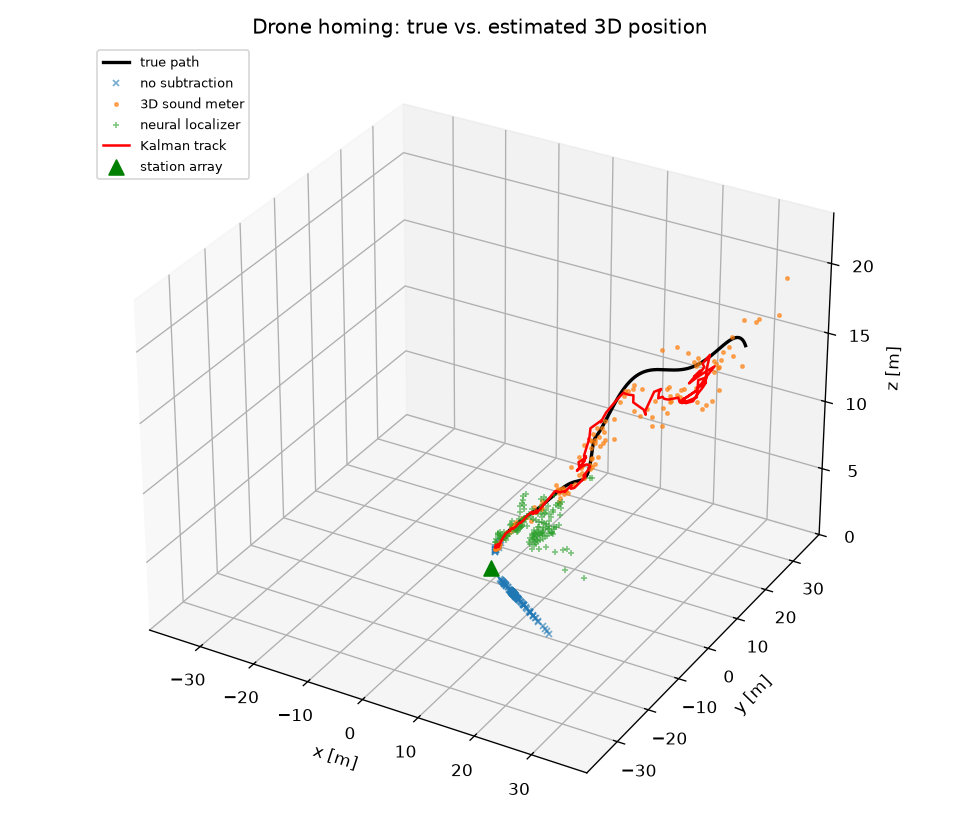
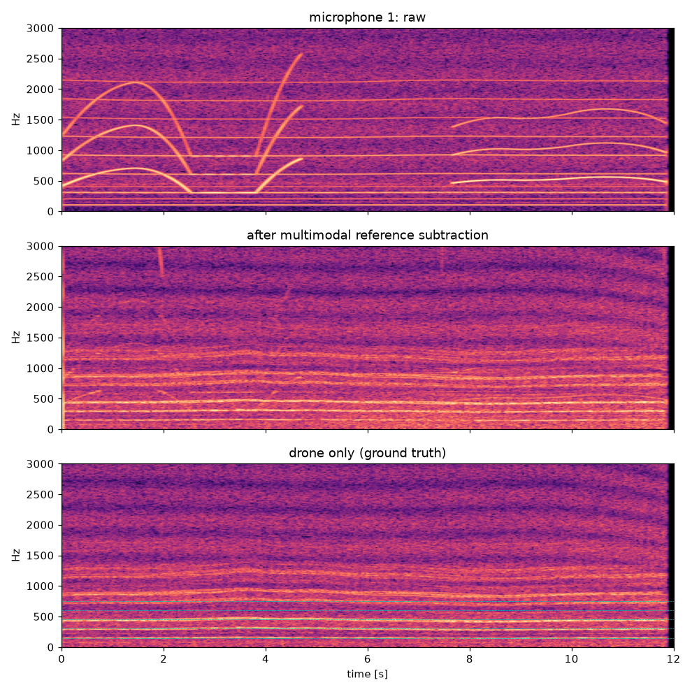
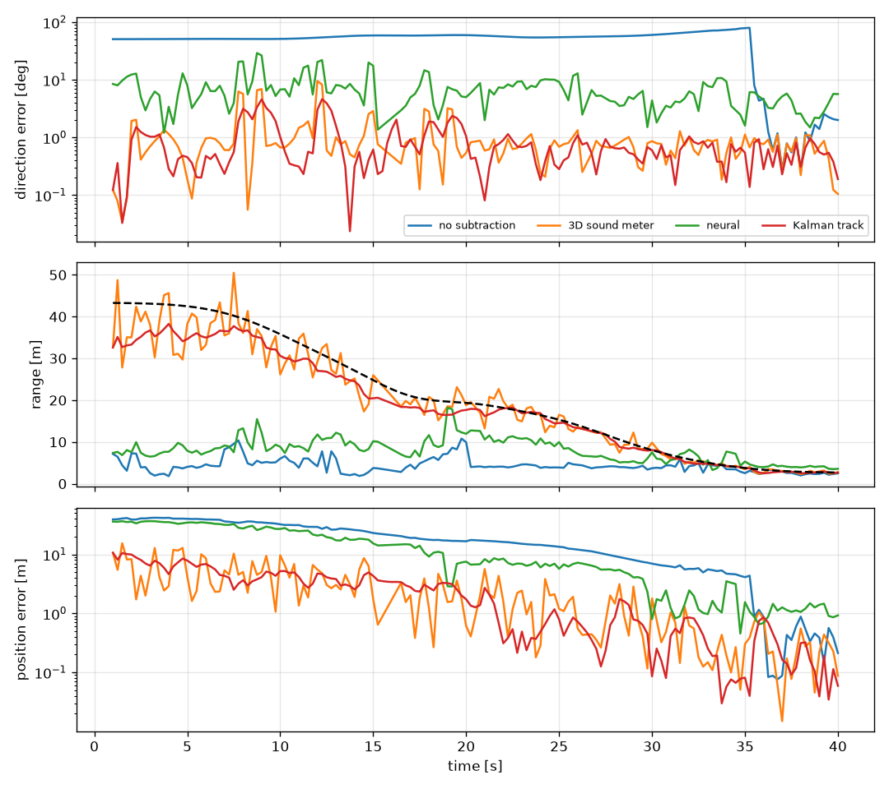

# Multimodal-Reference-Subtraction-Voiceprint-and-Three-Dimensional-Sound-Meter-for-Drone-Localization
3D acoustic homing for a battery-swap drone using a six-microphone spherical array, GCC-PHAT, rotor silence windows, and Kalman-filter tracking.

<div dir="rtl">

## نظرة عامة

يعمل المشروع بالكامل داخل بيئة محاكاة، وفيه أربع مراحل يتم تدريب كل منها:

| المرحلة | ماذا تفعل | الملف |
|---|---|---|
| ١. مكتبات صوت الدرون | نماذج صوتية لعدة أنواع درون + مجموعات بيانات حقيقية تختار منها النوع المستهدف | `droneloc/catalog.py`, `synth.py`, `datasets.py` |
| ٢. الطرح المرجعي متعدد الوسائط (Reference Subtraction) | ميكروفون مرجعي + حساس اهتزاز على ماكينات المحطة، يتدرّب على مرشح Wiener متعدد القنوات في نافذة بدون درون ثم يطرح التداخل | `reference_subtraction.py` |
| ٣. البصمة الصوتية (Voiceprint) | استخراج تردد مرور الشفرات (BPF) وتوافقياته + مصنف يحدد نوع الدرون ويتحقق أنه الدرون المستهدف | `voiceprint.py` |
| ٤. مقياس الصوت ثلاثي الأبعاد (3D Sound Meter) | الاتجاه من GCC-PHAT / SRP-PHAT الموجّه بالبصمة، والمسافة من انخفاض مستوى الصوت مقارنة بمستواه عند ١ م، ثم تتبع بمرشح كالمان. وفيه أيضاً محدد موقع عصبي (MLP) مدرَّب في المحاكاة | `localization.py`, `tracking.py` |

**بيئة المحاكاة** (`simulation.py`): محطة تبديل بطاريات عليها مصفوفة كروية من ٦ ميكروفونات (قطر 160 مم، ويمكن تغييره بـ `--array-radius`). الدرون يقترب بمسار حلزوني للهبوط. المحاكاة تشمل تأخير الانتشار و1/r و Doppler وانعكاس الأرض، إضافة إلى ضجيج ماكينات المحطة (طنين كهربائي ومروحة تبريد ومحرك آلية التبديل)، والرياح والطيور وضجيج الحساسات.

## التشغيل

```bash
pip install -r requirements.txt

python -m droneloc libraries                       # عرض المكتبات وأنواع الدرون المتاحة
python -m droneloc run --drone hexa_swap           # تدريب كل المراحل وتشغيل مهمة الهبوط
python -m droneloc run --drone dji_phantom4 --duration 60

# استخدام تسجيلات حقيقية بدل النموذج الاصطناعي
python -m droneloc download droneaudio
python -m droneloc run --drone parrot_mambo --dataset droneaudio

python -m pytest tests
```

تُحفظ النتائج في `outputs/`: تقرير `report.json`، والرسوم البيانية، وملفات صوت (`mic1_raw.wav` و `mic1_clean.wav` و `drone_truth.wav`) لتسمع الفرق قبل الطرح وبعده.

## مكتبات صوت الدرون

**نماذج اصطناعية** (تعمل بدون إنترنت، وتختار منها بـ `--drone`):

| key | النوع | مراوح × شفرات | RPM | BPF [Hz] | dB @1m |
|---|---|---|---|---|---|
| `dji_mini` | DJI Mini | 4×2 | 9600 | 320 | 70 |
| `dji_mavic` | DJI Mavic | 4×2 | 6600 | 220 | 76 |
| `dji_phantom4` | DJI Phantom 4 | 4×2 | 5400 | 180 | 80 |
| `parrot_bebop2` | Parrot Bebop 2 | 4×3 | 7900 | 395 | 75 |
| `parrot_mambo` | Parrot Mambo | 4×2 | 18400 | 613 | 68 |
| `dji_matrice300` | DJI Matrice 300 | 4×2 | 3300 | 110 | 88 |
| `hexa_swap` | سداسي مراوح لتبديل البطارية (افتراضي) | 6×2 | 4500 | 150 | 84 |

القيم تقريبية، ما عدا Bebop و Mambo فقد ضُبطت على ترددات BPF المقاسة من تسجيلاتهما الحقيقية. لدرون حقيقي، عدّل RPM والمستوى في `catalog.py` حسب قياساتك.

**مجموعات بيانات حقيقية** (`--dataset`):

| key | المحتوى | الاستخدام | تنزيل |
|---|---|---|---|
| `droneaudio` | DroneAudioDataset: Bebop و Mambo وخلفيات | تدريب البصمة | تلقائي |
| `svanstrom` | Drone detection dataset: درون وهليكوبتر وخلفية (صوت وفيديو) | بيانات بصمة إضافية وتجارب متعددة الوسائط | تلقائي |
| `esc50` | ESC-50: رياح ومطر وطيور ومحركات... | مكتبة تداخلات للطرح المرجعي | تلقائي |
| `dregon` | DREGON: مصفوفة ٨ ميكروفونات على درون مع المواقع الحقيقية | التحقق من التحديد المكاني على بيانات حقيقية | يدوي |
| `spcup2019` | IEEE SP Cup 2019 | قياس أداء تقدير الاتجاه | يدوي |
| `salford_dronenoise` | DroneNoise Database (معايرة SPL) | معايرة مستوى ١ م لمقياس الصوت | يدوي |

## النتائج (المحاكاة الافتراضية، `hexa_swap`، ٤٠ ثانية، seed 0، نصف قطر الكرة 8 سم)

- دقة مصنف البصمة على بيانات الاختبار: **97.9%** (٨ فئات)، ونسبة اكتشاف الدرون: 96% من الإطارات.
- الطرح المرجعي خفّض التداخل بمقدار **26.8 dB**، ورفع SNR في المصفوفة من **−7.1** إلى **+19.7 dB**.

| الطريقة | خطأ الاتجاه (وسيط) | خطأ المسافة | خطأ الموقع (وسيط / p90) |
|---|---|---|---|
| بدون طرح مرجعي | 54.9° | 75% | 16.8 / 39.6 m |
| مقياس الصوت 3D بعد الطرح | **0.8°** | **9%** | **1.8 / 7.0 m** |
| المحدد العصبي بعد الطرح | 5.8° | 50% | 7.3 / 34.5 m |
| تتبع كالمان | 0.6° | 10% | 1.8 / 6.6 m |





## ملاحظات وحدود

- بدون الطرح المرجعي يفشل التحديد المكاني بالكامل، لأن ماكينات المحطة القريبة تطغى على صوت الدرون.
- في هذا السيناريو لا يضيف حساس الاهتزاز تحسناً فوق الميكروفون المرجعي (26.8 dB في الحالتين)، لكنه يفيد عندما يكون الميكروفون المرجعي ملوثاً بالرياح أو بصوت الدرون نفسه.
- تقدير المسافة من المستوى يفترض أن مستوى الدرون ثابت. في الواقع يتغير مع الدفع (throttle)، ويتأثر بامتصاص الهواء والانعكاسات.
- المحدد العصبي أضعف من SRP-PHAT هنا. يتحسن بزيادة `--n-neural`، ويبقى مفيداً كبديل قابل للتدريب على بيانات حقيقية مثل DREGON.

</div>
