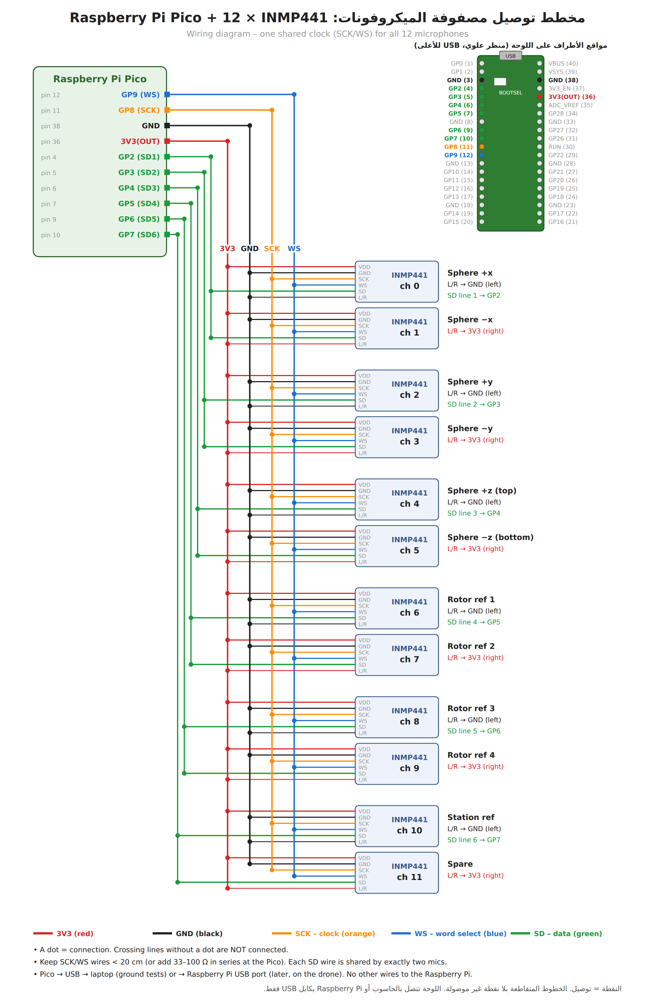

# Low-cost 12-channel microphone array (Raspberry Pi Pico + INMP441)

A ~25-40 USD replacement for the MCHStreamer + PDM breakout array: one
Raspberry Pi Pico (RP2040) reads up to 12 INMP441 I2S MEMS microphones with
**one shared bit clock**, so all channels are sample-synchronous, and streams
them over USB to `experiments/record_pico.py`, which writes a 12-channel WAV.

> Status: the firmware compiles (pico-sdk 2.1.1) and the PC side is tested
> with synthetic packets, but the firmware has **not yet been tested on real
> hardware**. Start with two microphones (`--check`) before wiring all twelve.

## Parts

| Part | Qty | Approx. price |
|---|---|---|
| Raspberry Pi Pico (RP2040; Pico H has headers soldered) | 1 | 4-6 USD |
| INMP441 I2S microphone module | 12 (+2 spare) | 1.5-3 USD each |
| Breadboard, Dupont jumper wires | - | ~5 USD |
| Micro-USB **data** cable | 1 | ~2 USD |

## Wiring



(`wiring.png` / `wiring.svg` are drawn by `wiring_diagram.py`.)

All microphones: `VDD -> 3V3(OUT)` (pin 36), `GND -> GND`, `SCK -> GP8` (pin 11),
`WS -> GP9` (pin 12). Each data line is shared by two microphones; the `L/R`
pin selects the slot (`GND` = left = even channel, `3V3` = right = odd channel).

| Channel | Role | SD pin | L/R |
|---|---|---|---|
| 0 | sphere +x | GP2 (pin 4) | GND |
| 1 | sphere -x | GP2 (pin 4) | 3V3 |
| 2 | sphere +y | GP3 (pin 5) | GND |
| 3 | sphere -y | GP3 (pin 5) | 3V3 |
| 4 | sphere +z | GP4 (pin 6) | GND |
| 5 | sphere -z | GP4 (pin 6) | 3V3 |
| 6 | rotor reference 1 | GP5 (pin 7) | GND |
| 7 | rotor reference 2 | GP5 (pin 7) | 3V3 |
| 8 | rotor reference 3 | GP6 (pin 9) | GND |
| 9 | rotor reference 4 | GP6 (pin 9) | 3V3 |
| 10 | station reference | GP7 (pin 10) | GND |
| 11 | spare | GP7 (pin 10) | 3V3 |

Keep SCK/WS wires short (< 20 cm). If they must be longer, put a 33-100 ohm
resistor in series at the Pico end of SCK and WS.

## Flash

Hold **BOOTSEL**, plug the Pico into USB, release; a drive `RPI-RP2` appears.
Copy `pico_mic_array.uf2` onto it. The LED blinks once per second while
waiting for the PC and stays on / toggles quickly while streaming.

## Record

```
pip install pyserial soundfile numpy
python experiments/record_pico.py --check                  # live level of every channel
python experiments/record_pico.py --seconds 30 --out run01.wav
python -m droneloc sphere-geometry sphere.csv
python -m droneloc evaluate-array --wav run01.wav --geometry sphere.csv --truth truth.csv --band 300,6800
python -m droneloc coherence --wav run01.wav --refs 6,7,8,9
```

Output: 15625 Hz, 16-bit, usable band up to 6.9 kHz (the `droneloc` tools
resample internally).

## Firmware details

* System clock 128 MHz, SCK = 2.0 MHz, 64 SCK per frame -> 31250 Hz from the
  microphones, then a 79-tap halfband filter (stopband > 56 dB) decimates 2:1
  to 15625 Hz, +12 dB digital gain, int16.
* PIO: one clock state machine (SCK/WS by side-set) and six capture state
  machines that sync on WS and sample each line on every rising SCK edge.
* Core 1 captures and filters into a ring buffer; core 0 sends USB CDC packets
  `"MICA" | seq | dropped | nch | nframes | fs | int16 data | checksum`.
  `record_pico.py` checks sequence and checksum and zero-fills lost packets
  so channels stay time-aligned.

Build from source (needs pico-sdk >= 2.0 and arm-none-eabi-gcc):

```
mkdir build && cd build
cmake -DPICO_SDK_PATH=/path/to/pico-sdk ..
make
```
